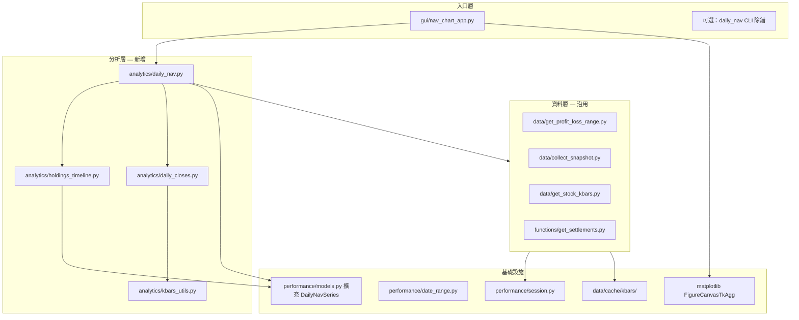
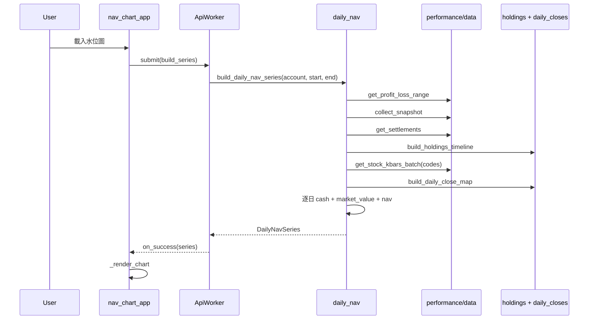
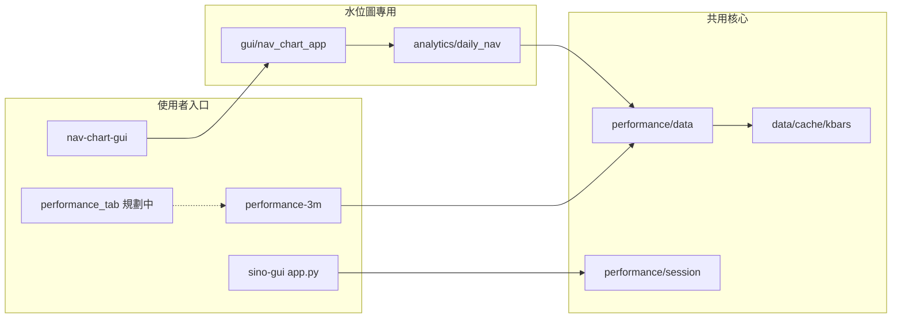

# 3 個月資金水位圖 GUI — 程式架構

## 1. 文件目的

本文件描述「3 個月資金水位圖 GUI」的程式架構、模組職責、資料流與分階段實作計畫。

需求定義見 [NAV_CHART_PLAN.md](./NAV_CHART_PLAN.md)。  
與區間績效報告的關係見 [PERFORMANCE_3M_ARCHITECTURE.md](./PERFORMANCE_3M_ARCHITECTURE.md)。

**Phase 0（本階段）**：僅撰寫規劃與架構文件，不實作程式碼。

---

## 2. 與現有專案的關係

本功能在既有 `sino-account` 專案上**擴充**，不取代現有模組。

```
test/
├── docs/
│   ├── SINO_GUI.md                 # sino-gui 使用指南
│   ├── SINO_GUI_ARCHITECTURE.md    # sino-gui 程式架構
│   ├── NAV_CHART_PLAN.md           # 需求規劃（本專案新增）
│   ├── NAV_CHART_ARCHITECTURE.md   # 程式架構（本文件）
│   ├── PERFORMANCE_3M_PLAN.md
│   └── PERFORMANCE_3M_ARCHITECTURE.md
├── src/sino_account/
│   ├── core/           # 沿用：session、serialize
│   ├── functions/      # 沿用：get_settlements 等
│   ├── gui/
│   │   ├── app.py              # sino-gui Debug GUI（見 SINO_GUI_ARCHITECTURE.md）
│   │   └── nav_chart_app.py    # 新增：獨立水位圖 GUI
│   └── performance/
│       ├── data/       # 沿用：kbars、profit_loss、snapshot
│       └── analytics/  # 擴充：daily_nav、holdings_timeline、daily_closes
├── data/cache/kbars/   # 沿用：kbars 本地快取
└── pyproject.toml      # 擴充：nav-chart-gui、matplotlib
```

### 設計原則

| 原則 | 說明 |
|------|------|
| 獨立 GUI 檔 | `nav_chart_app.py` 與 `app.py` 分離，避免 Debug 視窗複雜化 |
| 一 API 一檔（資料層） | 沿用 `performance/data/` 既有封裝，不重複包 API |
| 單執行緒 API | 複製 `ApiWorker` 模式，Shioaji 非 thread-safe |
| 複用快取 | 與 `performance-3m` 共用 `data/cache/kbars/` |

---

## 3. 整體架構



---

## 4. 目錄結構（實作階段）

```
src/sino_account/
├── gui/
│   ├── app.py                    # 既有 Debug GUI（不變）
│   └── nav_chart_app.py          # 新增：獨立水位圖 GUI
│
└── performance/
    ├── models.py                 # 擴充：DailyNavPoint、DailyNavSeries
    ├── date_range.py             # 沿用
    ├── session.py                # 沿用 ensure_performance_session()
    │
    ├── data/                     # 沿用（不新增檔）
    │   ├── get_profit_loss_range.py
    │   ├── collect_snapshot.py
    │   ├── get_stock_kbars.py
    │   └── ...
    │
    └── analytics/
        ├── kbars_utils.py        # 沿用；可選抽共用 normalize
        ├── daily_closes.py       # 新增：kbars → 日收盤價
        ├── holdings_timeline.py  # 新增：反向回放持倉
        └── daily_nav.py          # 新增：串接產出 DailyNavSeries

tests/
└── test_daily_nav.py             # 新增：mock 單元測試

docs/
├── NAV_CHART_PLAN.md
└── NAV_CHART_ARCHITECTURE.md
```

---

## 5. 模組職責表

### 5.1 分析層（新增）

| 模組 | 函數 | 輸入 | 輸出 |
|------|------|------|------|
| `holdings_timeline.py` | `build_holdings_timeline(trades, positions, start, end)` | 平倉交易、期末持倉 | `dict[date, dict[code, qty_lots]]` |
| `daily_closes.py` | `kbars_to_daily_closes(kbars)` | 單檔 kbars JSON | `dict[date, close]` |
| `daily_closes.py` | `build_daily_close_map(codes, kbars_by_code, start, end)` | 多檔 kbars | `dict[code, dict[date, close]]` + forward fill |
| `daily_nav.py` | `build_daily_nav_series(account, start, end)` | 帳戶、區間 | `DailyNavSeries` |
| `daily_nav.py` | `calc_daily_market_value(holdings, close_map, date)` | 單日 | `float` |
| `daily_nav.py` | `calc_daily_cash(ending_cash, settlements, date)` | 單日 | `float` |

### 5.2 資料層（沿用）

| 模組 | 函數 | Shioaji API |
|------|------|-------------|
| `get_profit_loss_range.py` | `get_profit_loss_range(account, start, end)` | `list_profit_loss` |
| `collect_snapshot.py` | `collect_snapshot(account)` | `account_balance`, `list_positions` |
| `get_stock_kbars.py` | `get_stock_kbars_batch(codes, start, end)` | `kbars` |
| `functions/get_settlements.py` | `get_settlements(account)` | `settlements` |

### 5.3 模型擴充（`performance/models.py`）

```python
@dataclass
class DailyNavPoint:
    date: str
    nav: float
    cash: float
    market_value: float

@dataclass
class DailyNavSeries:
    start: str
    end: str
    points: list[DailyNavPoint] = field(default_factory=list)
    warnings: list[str] = field(default_factory=list)
    method_note: str = "每日資金水位為估算值，非券商官方 NAV"
```

### 5.4 GUI 層（`gui/nav_chart_app.py`）

| 類別 / 函數 | 職責 |
|-------------|------|
| `ApiWorker` | 複製自 `app.py`：單一背景執行緒 API 佇列 |
| `NavChartApp` | Tkinter 主視窗：帳戶、日期、按鈕、圖表、狀態 |
| `_load_chart()` | 經 `ApiWorker` 呼叫 `build_daily_nav_series()` |
| `_render_chart(series)` | matplotlib 三線圖繪製 |
| `main()` | 進入點 |

---

## 6. 資料流



### 6.1 需查 kbars 的 code 集合

```python
codes = {t["code"] for t in trades} | {p["code"] for p in positions}
codes.discard("")
```

與 `build_report._extract_codes()` 邏輯一致，可抽成 `performance/accounts.py` 或 `daily_nav.py` 內部函數。

### 6.2 日曆日迭代

```python
for d in date_range_inclusive(start, end):
    holdings_d = holdings_timeline.resolve(d)
    market_value = calc_daily_market_value(holdings_d, close_map, d)
    cash = calc_daily_cash(ending_cash, settlements, d)
    nav = cash + market_value
    points.append(DailyNavPoint(d, nav, cash, market_value))
```

---

## 7. GUI 整合

### 7.1 與 Debug GUI 的關係

| 項目 | Debug `app.py` | `nav_chart_app.py` |
|------|----------------|-------------------|
| 視窗 | 單頁按鈕 + JSON | 圖表為主 |
| 登入 | `perform_login(fetch_contract=False)` | `ensure_performance_session()` |
| 共用 | `core/session.py` 全域 `_api` | 同一 session 物件（若先開 Debug 再開水位圖，會觸發重新登入載入商品檔） |
| 修改 | **不修改** | 全新檔案 |

### 7.2 `nav_chart_app.py` 版面

```
┌─────────────────────────────────────────────────────────┐
│ [帳戶 ▼]  Begin [____]  End [____]  [Login] [Logout]   │
├─────────────────────────────────────────────────────────┤
│ [載入水位圖]                              狀態：就緒    │
├─────────────────────────────────────────────────────────┤
│                                                         │
│              matplotlib 三線圖區域                       │
│         — NAV  — 現金  — 持倉市值                        │
│                                                         │
├─────────────────────────────────────────────────────────┤
│ 說明：每日資金水位為估算值，非券商官方 NAV                 │
│ Warnings: ...                                           │
└─────────────────────────────────────────────────────────┘
```

### 7.3 ApiWorker 互動

```python
def _on_load_chart(self):
    start = self.begin_var.get()
    end = self.end_var.get()
    account = self._selected_account()

    def task():
        ensure_performance_session()
        return build_daily_nav_series(account, start, end)

    self._api_worker.submit(
        task,
        on_success=self._render_chart,
        on_error=self._show_error,
    )
```

進度更新（Phase 2）：`task()` 內分段 `root.after` 更新狀態列（收集交易 / 查詢 kbars / 計算）。

### 7.4 matplotlib 嵌入

```python
from matplotlib.figure import Figure
from matplotlib.backends.backend_tkagg import FigureCanvasTkAgg

fig = Figure(figsize=(10, 5), dpi=100)
ax = fig.add_subplot(111)
ax.plot(dates, nav_values, label="總資金水位")
ax.plot(dates, cash_values, label="現金")
ax.plot(dates, mv_values, label="持倉市值")
ax.legend()
canvas = FigureCanvasTkAgg(fig, master=chart_frame)
canvas.draw()
```

---

## 8. CLI 入口

[`pyproject.toml`](../pyproject.toml) 新增：

```toml
[project]
dependencies = [
    "shioaji>=1.2.5",
    "python-dotenv>=1.0.0",
    "matplotlib>=3.7.0",
]

[project.scripts]
nav-chart-gui = "sino_account.gui.nav_chart_app:main"
```

執行範例：

```powershell
conda activate sino_agent_test
nav-chart-gui
```

Phase 1 可選除錯 CLI（不一定要暴露為 script）：

```python
# daily_nav.py 底部
if __name__ == "__main__":
    series = build_daily_nav_series(...)
    for p in series.points:
        print(p.date, p.nav, p.cash, p.market_value)
```

---

## 9. 快取策略

沿用 [PERFORMANCE_3M_ARCHITECTURE.md](./PERFORMANCE_3M_ARCHITECTURE.md) §9：

| 路徑 | 內容 |
|------|------|
| `data/cache/kbars/{code}_{start}_{end}.json` | 個股 kbars |
| `data/cache/kbars/INDEX_001_{start}_{end}.json` | 大盤（本功能可不用） |

水位圖與 `performance-3m` **共用快取**；首次查詢較慢，之後載入圖表應明顯加速。

`.gitignore` 已含 `data/cache/`、`reports/`。

---

## 10. 錯誤處理策略

| 情境 | 處理 |
|------|------|
| 未登入 | GUI 提示 Login；`build_daily_nav_series` 內呼叫 `ensure_performance_session()` |
| 非證券帳戶 | `ensure_stock_account()` 拋 `ValueError` |
| kbars 缺碼 | 該 code 當日市值 0，`warnings` 記錄 |
| settlements 為空 | 現金平坦線 + warning |
| 期末校準偏差大 | warning 提示回放或收盤價可能有誤 |
| API 忙碌 | `ApiWorker._busy` 阻擋重複點擊 |

---

## 11. 分階段實作計畫

| 階段 | 內容 | 產出 | 可獨立驗證 |
|------|------|------|------------|
| **Phase 0** | 撰寫 PLAN + ARCHITECTURE | `docs/NAV_CHART_*.md` | 文件審閱 |
| **Phase 1** | 分析層 + models + tests | `daily_nav` 等模組 | `python tests/test_daily_nav.py` |
| **Phase 2** | 獨立 GUI + matplotlib | `nav-chart-gui` | 視覺檢查三線圖 |
| **Phase 3** | 匯出、假日曆、零股、worker 共用 | 穩定版 | 回歸測試 |

### Phase 1 建議開發順序

1. `performance/models.py` — 新增 `DailyNavPoint`、`DailyNavSeries`
2. `analytics/daily_closes.py` — 日收盤聚合 + forward fill
3. `analytics/holdings_timeline.py` — 反向回放
4. `analytics/daily_nav.py` — 串接 `build_daily_nav_series()`
5. `tests/test_daily_nav.py` — mock trades / positions / kbars / settlements

### Phase 2 建議開發順序

1. `pyproject.toml` — `matplotlib`、`nav-chart-gui`
2. `gui/nav_chart_app.py` — 骨架 + ApiWorker + Login
3. 接上 `build_daily_nav_series()` + `_render_chart()`
4. 狀態列進度與 warnings 顯示

### Phase 3 建議項目

- 匯出 `daily_nav.csv` / `daily_nav.json`
- 台股交易日曆（減少假日 forward fill 誤差）
- `Unit.Share` 零股乘數
- 將 `ApiWorker` 抽至 `gui/worker.py` 供 `app.py` 與 `nav_chart_app.py` 共用
- kbars 批次進度條（N / total codes）

---

## 12. 測試策略

### 12.1 單元測試（`tests/test_daily_nav.py`）

| 測試案例 | 驗證 |
|----------|------|
| `kbars_to_daily_closes` 分 K 聚合 | 同日取最後 Close |
| 奈秒 `ts` 轉日期 | 不觸發 Windows Errno 22 |
| `build_holdings_timeline` 反向回放 | 賣出後加回張數；期末與 snapshot 一致 |
| `calc_daily_cash` | 交割款日期前後現金階梯正確 |
| `calc_daily_market_value` | 張數 × 收盤 × 1000 |
| `build_daily_nav_series` 整合 | mock 資料 end 日 nav 合理 |

### 12.2 手動驗收

1. 登入後載入 3 個月水位圖
2. 確認三線圖顯示、warnings 區塊、方法說明
3. 與 `performance-3m` 期末 `ending_nav` 同一數量級
4. 第二次載入應快於首次（kbars 快取）

### 12.3 不納入 CI 的測試

- 需真實 Shioaji 連線的整合測試（手動執行）

---

## 13. API 對照總表

| 模組 file | Shioaji API | 帳戶類型 | 需 fetch_contract |
|-----------|-------------|----------|-------------------|
| `get_profit_loss_range.py` | `list_profit_loss` | S | 否 |
| `collect_snapshot.py` | `account_balance`, `list_positions` | S | 否 |
| `get_settlements.py` | `settlements` | S | 否 |
| `get_stock_kbars.py` | `kbars` | — | **是** |

---

## 14. 與其他入口的邊界



- **Debug GUI**：帳務 debug，不畫圖
- **performance-3m**：區間摘要報告
- **nav-chart-gui**：每日 NAV 三線圖（本文件範圍）
- **performance_tab**（未實作）：一鍵報告，與水位圖 GUI 分開
