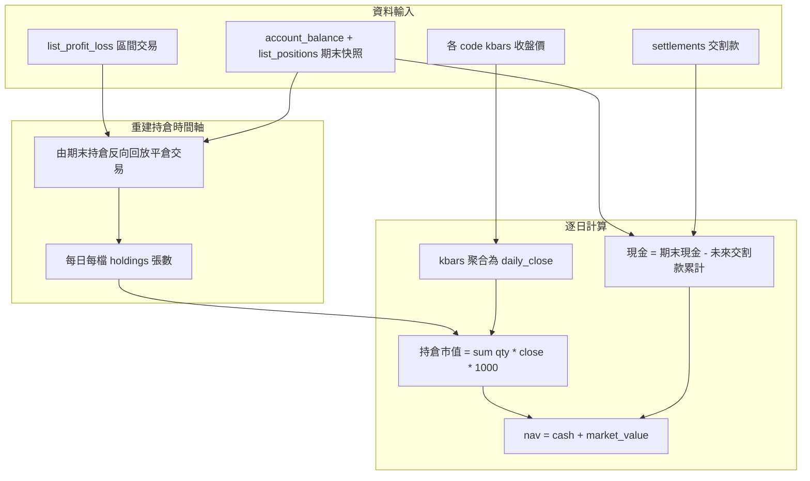

# 3 個月資金水位圖 GUI — 需求規劃書

## 1. 背景與目標

本專案在既有 `sino-account` 模組化架構上，新增**獨立 GUI 應用**，繪製證券帳戶近 **3 個月、以日為單位**的**資金水位圖**。

與 [PERFORMANCE_3M_PLAN.md](./PERFORMANCE_3M_PLAN.md) 的差異：

| 項目 | `performance-3m` | 資金水位圖 GUI |
|------|------------------|----------------|
| 輸出 | 區間摘要（單一期初／期末 NAV、報酬率%） | **每日** NAV 時間序列 + 圖表 |
| 入口 | CLI `performance-3m` | 獨立 GUI `nav-chart-gui` |
| 股價用途 | 大盤 benchmark、kbars 快取 | **每日收盤價 mark-to-market** 持倉市值 |
| 整合方式 | 報告 JSON/MD | 不併入 Debug `sino-gui` |

使用者需要同時掌握：

- **歷史交易紀錄**（區間內已平倉損益）
- **個股歷史收盤價**（`api.kbars` 日聚合）
- **每日資金組成**（總 NAV、現金、持倉市值三條曲線）

本文件為 **Phase 0 規劃文件**，定義需求、演算法與驗收標準。程式架構見 [NAV_CHART_ARCHITECTURE.md](./NAV_CHART_ARCHITECTURE.md)。

---

## 2. 使用者故事

1. 身為股票投資者，我希望打開**獨立視窗**，選擇帳戶與 3 個月區間，**一眼看出資金水位每日變化**。
2. 身為投資者，我希望圖上同時顯示**總資金（NAV）、現金、持倉市值**，了解資金在現金與股票之間如何配置。
3. 身為開發者，我希望此 GUI 為**獨立 Python 檔**（`nav_chart_app.py`），不影響既有 Debug GUI 按鈕邏輯。
4. 身為投資者，我接受此圖為**估算值**（API 無歷史每日帳戶快照），但希望畫面明確標註限制。

---

## 3. 輸入與輸出定義

### 3.1 輸入

| 參數 | 型別 | 預設 | 說明 |
|------|------|------|------|
| `account` | StockAccount | `api.stock_account` | 僅支援 `account_type = "S"` |
| `start` | `YYYY-MM-DD` | 今日往前 3 個曆月 | 區間起始日 |
| `end` | `YYYY-MM-DD` | 今日 | 區間結束日 |

### 3.2 輸出：`DailyNavSeries`

```python
@dataclass
class DailyNavPoint:
    date: str              # YYYY-MM-DD
    nav: float             # 總資金水位 = cash + market_value
    cash: float            # 估算現金餘額
    market_value: float    # 持倉市值（收盤價 mark-to-market）

@dataclass
class DailyNavSeries:
    start: str
    end: str
    points: list[DailyNavPoint]
    warnings: list[str]
    method_note: str = "每日資金水位為估算值，非券商官方 NAV"
```

### 3.3 圖表輸出（GUI）

| 曲線 | 資料欄位 | 顏色建議 | 說明 |
|------|----------|----------|------|
| 總資金水位 | `nav` | 藍色 | 主曲線 |
| 現金餘額 | `cash` | 綠色 | 輔助曲線 |
| 持倉市值 | `market_value` | 橘色 | 輔助曲線 |

- X 軸：日期（日）
- Y 軸：金額（TWD）
- 圖例：三條線名稱
- 標題：含帳戶、區間、方法說明

---

## 4. 資料來源與 API 對照

### 4.1 帳務 API

| 資料 | API / 封裝模組 | 用途 |
|------|----------------|------|
| 區間已平倉交易 | `api.list_profit_loss` → `get_profit_loss_range()` | 反向回放持倉張數 |
| 期末現金 | `api.account_balance` → `collect_snapshot()` | 現金錨點 |
| 期末持倉 | `api.list_positions` → `collect_snapshot()` | 持倉錨點（張） |
| 交割款 | `api.settlements` → `get_settlements()` | 每日現金近似 |

#### StockProfitLoss 主要欄位（交易回放）

| 欄位 | 說明 |
|------|------|
| `code` | 商品代碼 |
| `quantity` | 平倉張數 |
| `date` | 交易日期 |
| `price` | 成交價格 |
| `pnl` | 已實現損益 |

#### SettlementV1 主要欄位

| 欄位 | 說明 |
|------|------|
| `date` | 交割日期 |
| `amount` | 交割金額（正＝入帳、負＝出帳） |
| `T` | T day |

### 4.2 行情 API

| 資料 | API / 封裝模組 | 用途 |
|------|----------------|------|
| 個股 K 線 | `api.kbars(contract, start, end)` → `get_stock_kbars()` | 聚合為每日收盤價 |

**注意**：

- 登入需 `fetch_contract=True`（`ensure_performance_session()`）
- `kbars` 單次 session 上限 270 次；僅查「區間內曾持有或有平倉」的 `code`
- 本地快取：`data/cache/kbars/{code}_{start}_{end}.json`

### 4.3 不使用的 API（本功能）

| API | 原因 |
|-----|------|
| `list_trades` | 無法回溯歷史成交 |
| `list_profit_loss_detail` | Phase 1 不強制；持倉回放以 `list_profit_loss` + 期末快照即可 |
| `list_profit_loss_summary` | 彙總用，無法還原每日持倉 |

---

## 5. 每日 NAV 估算演算法

Shioaji **不提供歷史每日** `account_balance` / `list_positions`。本演算法以**期末快照為錨點**，搭配交易回放與收盤價 mark-to-market，逐日估算 NAV。



### Step 1 — 持倉時間軸（反向回放）

模組：`analytics/holdings_timeline.py`

1. 以期末 `list_positions` 初始化 `holdings[code] = quantity`（張）
2. 將區間 `list_profit_loss` 依 `date` **由近到遠**排序（同日多筆依原序）
3. 每筆平倉：`holdings[code] += quantity`（undo 賣出，加回張數）
4. 在每個**有交易**的日期結束時，記錄 `holdings_snapshot[date]`
5. 對區間內每個曆日 `d`：取 `d` 當日或之前最近一個快照的持倉；若無交易則沿用前日

**特殊情況**：

- 區間內**僅買未賣**：標的只出現在期末 `positions`，不出現在 `trades`；區間起始日該標的持倉為 0
- 區間內**賣光**：標的出現在 `trades` 但不在期末 `positions`；回放至賣出日後張數歸零

### Step 2 — 每日收盤價

模組：`analytics/daily_closes.py`（或擴充 `kbars_utils.py`）

函數：`kbars_to_daily_closes(kbars) -> dict[str, float]`（`date → close`）

規則：

1. 將 `kbars` 的 `ts` / `datetime` 正規化為 `YYYY-MM-DD`（奈秒 `ts` 需 ÷ 1e9，見既有 `kbars_utils._normalize_date`）
2. 同一曆日多筆 K 棒（分 K）取**當日最後一筆** `Close`
3. 對持倉標的、在區間每個曆日：若無收盤價（假日），**向前填補**最近一個交易日的收盤價（forward fill）
4. 若某 `code` 完全無 kbars：該日市值貢獻為 0，並加入 `warnings`

### Step 3 — 每日持倉市值

```
market_value[d] = Σ holdings[d][code] × daily_close[code][d] × STOCK_SHARES_PER_LOT
```

其中 `STOCK_SHARES_PER_LOT = 1000`（與 `analytics/unrealized.py` 一致；`list_positions` 預設以「張」回報）。

### Step 4 — 每日現金（近似）

以期末 `acc_balance` 為錨點：

```
cash[d] = ending_cash − Σ settlement.amount   （settlement.date > d）
```

說明：

- 交割款已反映 T+2 等資金進出時點，比用 `pnl` 回推逐日現金穩定
- 此為**近似**；無法還原融資／融券保證金等細項
- 若 `settlements` 為空，則區間內 `cash[d] = ending_cash`（平坦線），並加入警告

### Step 5 — 每日 NAV

```
nav[d] = cash[d] + market_value[d]
```

### 期末校準（可選檢查）

最後一日 `d = end` 的估算值應接近即時快照：

```
ending_nav ≈ acc_balance + Σ position.last_price × position.quantity × 1000
```

若偏差超過門檻（例如 5%），加入 `warnings` 提示持倉回放或收盤價聚合可能有誤。

---

## 6. 圖表規格

### 6.1 版面

| 區塊 | 元件 |
|------|------|
| 頂部 | 帳戶下拉（僅 S）、Begin/End 日期、Login / Logout |
| 操作 | 「載入水位圖」按鈕 |
| 主圖 | `matplotlib` 三線圖 |
| 狀態 | 進度文字（收集交易 → 查詢 kbars → 計算中） |
| 底部 | warnings 列表；方法說明文字 |

### 6.2 繪圖規則

- 僅繪製 `start ≤ date ≤ end` 的 `DailyNavPoint`
- 三線共用 Y 軸（金額）
- 格線：淺色虛線
- 資料點過密時可不畫 marker，僅畫線
- 視窗標題：`資金水位圖 — {broker_id}-{account_id}`

### 6.3 執行環境

```powershell
conda activate sino_agent_test
nav-chart-gui
```

---

## 7. 限制與誤差來源

| 限制 | 影響 | 緩解 |
|------|------|------|
| 無歷史每日帳戶快照 | 每日 NAV 為估算 | 畫面與輸出標註 `method_note` |
| `list_profit_loss` 僅含平倉 | 無法從交易 API 還原買進日 | 以期末持倉 + 反向回放；純買進標的起始持倉為 0 |
| 現金以交割款近似 | 與實際逐日餘額可能有落差 | 文件與 warnings 說明 |
| kbars 可能為分 K | 需日聚合；假日 forward fill | `daily_closes` 模組 |
| kbars 270 次上限 | 持股種類多時可能超限 | 本地快取；僅查相關 code |
| 零股帳戶 | 張數乘數可能非 1000 | Phase 3 支援 `Unit.Share` |
| 融資／融券 | 市值公式未含保證金結構 | 現階段僅支援現股為主帳戶 |

---

## 8. 錯誤處理

| 情境 | 處理 |
|------|------|
| 未登入 | 提示先 Login；或自動 `ensure_performance_session()` |
| 非證券帳戶 | `ValueError`，僅支援 S |
| 商品檔未載入 | 重新登入 `fetch_contract=True` |
| kbars 某 code 失敗 | 跳過該 code 市值，加入 `warnings` |
| 區間無交易且無持倉 | 產出平坦 NAV 線或提示無資料 |
| `start > end` | 拋出 `ValueError` |
| matplotlib 未安裝 | 啟動時提示安裝依賴 |

---

## 9. 驗收標準

1. `nav-chart-gui` 可啟動**獨立視窗**，不修改、不依賴 Debug `sino-gui` 主流程
2. 預設 3 個月區間，X 軸為日期（日）
3. 圖上三條線：**NAV、現金、持倉市值**；Y 軸為 TWD 金額
4. 資料可追溯：交易來自 `list_profit_loss`；收盤價來自 `kbars` 日聚合
5. 畫面標註「估算值，非券商官方 NAV」
6. kbars 快取命中後，重開 GUI 載入明顯加速
7. 單元測試（mock 資料）涵蓋：持倉回放、日收盤聚合、NAV 公式

---

## 10. 與 `performance-3m` 的關係

| 共用 | 獨立 |
|------|------|
| `performance/data/*` 資料收集 | `analytics/daily_nav.py` 等每日序列 |
| `performance/session.py` 登入流程 | `gui/nav_chart_app.py` 獨立 GUI |
| `data/cache/kbars/` 快取 | `DailyNavSeries` 模型 |
| `date_range.three_month_range()` | matplotlib 繪圖 |

`performance-3m` CLI 維持產出區間摘要報告；資金水位圖 GUI **不取代** CLI，亦與規劃中的 `gui/performance_tab.py`（一鍵報告）分開開發。

---

## 11. 分階段實作概要

| 階段 | 內容 |
|------|------|
| **Phase 0** | 本文件 + [NAV_CHART_ARCHITECTURE.md](./NAV_CHART_ARCHITECTURE.md) |
| **Phase 1** | `holdings_timeline`、`daily_closes`、`daily_nav` + 單元測試 |
| **Phase 2** | `nav_chart_app.py` + `nav-chart-gui` 入口 + matplotlib |
| **Phase 3** | 匯出 CSV/JSON、假日曆、零股、kbars 限流強化 |

詳細模組與開發順序見架構文件。
