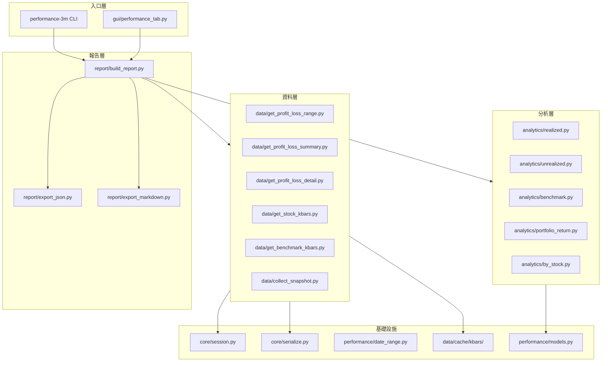
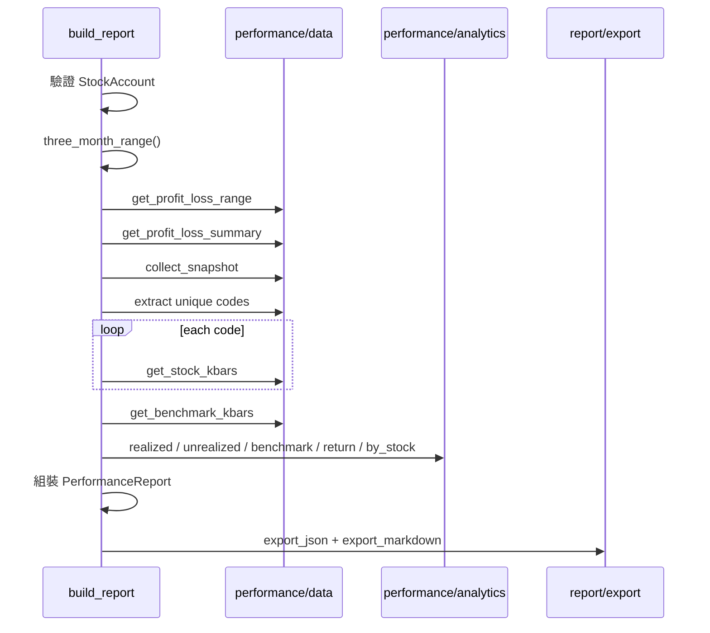

# 3 個月股票帳戶績效 — 程式架構

## 1. 文件目的

本文件描述「3 個月股票帳戶績效」功能的程式架構、模組職責、資料流與分階段實作計畫。

需求定義見 [PERFORMANCE_3M_PLAN.md](./PERFORMANCE_3M_PLAN.md)。

**Phase 0（本階段）**：僅撰寫規劃與架構文件，不實作程式碼。

---

## 2. 與現有專案的關係

本功能在既有 `sino-account` 專案上**擴充**，不取代現有模組。

```
test/
├── docs/
│   ├── SINO_GUI.md                     # sino-gui 使用指南
│   ├── SINO_GUI_ARCHITECTURE.md        # sino-gui 程式架構
│   ├── SINO_API_GUIDE.md               # Shioaji 帳務 API 使用指南
│   ├── SINO_POSITION_ALGORITHMS.md     # 持倉股數、市值、NAV 演算法
│   ├── PERFORMANCE_3M_PLAN.md          # 需求規劃（本專案新增）
│   └── PERFORMANCE_3M_ARCHITECTURE.md # 程式架構（本文件）
├── src/sino_account/
│   ├── core/           # 沿用：session、serialize
│   ├── functions/      # 沿用：login、get_* 等 debug 函數
│   ├── gui/            # sino-gui（app.py）及 nav-chart-gui 等
│   └── performance/    # 新增：績效專用套件
├── data/cache/         # 新增：kbars 本地快取（實作階段）
└── pyproject.toml      # 擴充：新增 performance-3m CLI
```

### 沿用模組

| 模組 | 路徑 | 用途 |
|------|------|------|
| Session | `core/session.py` | 共用 API 連線、`.env` 載入 |
| Serialize | `core/serialize.py` | Shioaji 回傳物件 → JSON 安全格式 |
| ApiWorker | `gui/app.py` | GUI 單一 API 執行緒（sino-gui / 績效 GUI 沿用） |
| 既有 functions | `functions/*.py` | Debug GUI 按鈕測試（見 [SINO_GUI_ARCHITECTURE.md](./SINO_GUI_ARCHITECTURE.md)） |

---

## 3. 整體架構



---

## 4. 目錄結構（實作階段）

```
src/sino_account/performance/
├── __init__.py
├── date_range.py                 # 計算 3 個月區間
├── models.py                     # PerformanceReport 等 dataclass
│
├── data/                         # 每個 API 一個 file（可獨立 debug）
│   ├── __init__.py
│   ├── get_profit_loss_range.py  # 分批查 list_profit_loss
│   ├── get_profit_loss_summary.py
│   ├── get_profit_loss_detail.py
│   ├── get_stock_kbars.py        # 個股 kbars + 快取
│   ├── get_benchmark_kbars.py    # 加權指數 kbars
│   └── collect_snapshot.py       # balance + positions
│
├── analytics/                    # 純計算，不呼叫 API
│   ├── __init__.py
│   ├── realized.py               # 已實現損益加總
│   ├── unrealized.py             # 未實現損益加總
│   ├── benchmark.py              # 大盤報酬率
│   ├── portfolio_return.py       # 組合報酬率估算
│   └── by_stock.py               # 個股貢獻彙總
│
└── report/                       # 組裝與輸出
    ├── __init__.py
    ├── build_report.py           # 主流程 + CLI entry
    ├── export_json.py
    └── export_markdown.py

src/sino_account/gui/
├── app.py                        # 改為 ttk.Notebook 多頁籤
└── performance_tab.py              # 3 個月績效頁籤

data/cache/kbars/                 # gitignore，本地 kbars 快取
└── {code}_{start}_{end}.json
```

---

## 5. 模組職責

### 5.1 `performance/date_range.py`

| 函數 | 說明 |
|------|------|
| `three_month_range(end: date \| None) -> tuple[str, str]` | 回傳 `(start, end)` 字串 |
| `monthly_chunks(start, end) -> list[tuple[str, str]]` | 將區間切為每月一批（帳務 API 限流用） |

### 5.2 `performance/models.py`

| 類別 | 說明 |
|------|------|
| `Period` | `start`, `end` |
| `AccountRef` | `broker_id`, `account_id`, `account_type` |
| `PerformanceSummary` | 摘要指標（見 PLAN.md 第 6.3 節） |
| `StockContribution` | 個股貢獻一筆 |
| `PerformanceReport` | 完整報告根物件 |
| `PerformanceMeta` | 產生時間、方法說明、warnings |

### 5.3 `performance/data/` — 資料收集

每個 file **一個公開函數**，從 `session.get_api()` 取 API，回傳已 `serialize()` 的 dict/list。

| 檔案 | 公開函數 | Shioaji API |
|------|----------|-------------|
| `get_profit_loss_range.py` | `get_profit_loss_range(account, start, end)` | `list_profit_loss`（按月分批合併） |
| `get_profit_loss_summary.py` | `get_profit_loss_summary(account, start, end)` | `list_profit_loss_summary` |
| `get_profit_loss_detail.py` | `get_profit_loss_detail(account, detail_id)` | `list_profit_loss_detail` |
| `get_stock_kbars.py` | `get_stock_kbars(code, start, end)` | `api.kbars` + 本地快取 |
| `get_benchmark_kbars.py` | `get_benchmark_kbars(start, end)` | `api.kbars(Indexs["001"])` |
| `collect_snapshot.py` | `collect_snapshot(account)` | `account_balance` + `list_positions` |

#### `get_profit_loss_range.py` 分批策略

```python
# 概念流程
chunks = monthly_chunks(start, end)
all_trades = []
for chunk_start, chunk_end in chunks:
    trades = api.list_profit_loss(account, chunk_start, chunk_end)
    all_trades.extend(serialize(trades))
    throttle(0.25)  # 遵守 5 秒 25 次限制
return all_trades
```

#### `get_stock_kbars.py` 快取策略

```
cache_path = data/cache/kbars/{code}_{start}_{end}.json
if cache_path.exists():
    return load_json(cache_path)
result = api.kbars(contract, start, end)
save_json(cache_path, serialize(result))
return result
```

合約解析：

```python
contract = api.Contracts.Stocks[code]  # 上市
# 若 KeyError，嘗試 api.Contracts.Stocks.TSE[code] 或 OTC
```

#### 績效查詢專用登入

績效功能需要商品檔，登入參數與 debug GUI 不同：

```python
api.login(
    api_key=...,
    secret_key=...,
    fetch_contract=True,   # 績效查詢必須 True
    subscribe_trade=False,
)
```

建議在 `build_report.py` 內自行登入／登出，或提供 `session.perform_login(fetch_contract=True)` 參數。

### 5.4 `performance/analytics/` — 分析計算

純函數，輸入已序列化的 dict/list，輸出數值或結構化結果。**不呼叫 Shioaji API**。

| 檔案 | 輸入 | 輸出 |
|------|------|------|
| `realized.py` | `trades[]` | `realized_pnl_total` |
| `unrealized.py` | `positions[]` | `unrealized_pnl_total`, `position_market_value` |
| `benchmark.py` | `index_kbars` | `benchmark_return_pct` |
| `portfolio_return.py` | summary 各項 | `estimated_beginning_nav`, `portfolio_return_pct` |
| `by_stock.py` | trades, positions, summary | `by_stock[]` |

### 5.5 `performance/report/` — 報告組裝

| 檔案 | 職責 |
|------|------|
| `build_report.py` | 主流程：收集資料 → 分析 → 組裝 `PerformanceReport`；CLI `main()` |
| `export_json.py` | `PerformanceReport` → `report_3m.json` |
| `export_markdown.py` | `PerformanceReport` → `report_3m.md` |

#### `build_report.py` 主流程



---

## 6. GUI 整合

### 6.1 頁籤結構

將 [`gui/app.py`](../src/sino_account/gui/app.py) 改為 `ttk.Notebook`：

| 頁籤 | 內容 |
|------|------|
| Debug | 現有按鈕（Login、Get Account Info 等），邏輯不變 |
| Performance 3M | 新頁籤，見 `performance_tab.py` |

### 6.2 `gui/performance_tab.py`

| 元件 | 說明 |
|------|------|
| 帳戶下拉 | 沿用 Debug 頁的帳戶列表（僅顯示 S 類型） |
| 日期區間 | 預設 3 個月，可覆寫 start/end |
| 「產生報告」按鈕 | 透過 `ApiWorker` 呼叫 `build_report.run_report()` |
| 結果區 | 顯示 Markdown；提供「儲存 JSON」按鈕 |
| 狀態列 | 顯示進度（收集交易、查詢股價、計算中） |

**執行緒**：所有 API 呼叫必須經 `ApiWorker` 單一執行緒，與 Debug 頁相同。

---

## 7. CLI 入口

[`pyproject.toml`](../pyproject.toml) 新增：

```toml
[project.scripts]
query-portfolio = "sino_account.query_portfolio:main"
sino-gui = "sino_account.gui.app:main"
performance-3m = "sino_account.performance.report.build_report:main"
```

執行範例：

```powershell
conda activate sino_agent_test
performance-3m
performance-3m --start 2026-03-06 --end 2026-06-06 --output ./reports/
```

---

## 8. API 對照總表

| 模組 file | Shioaji API | 帳戶類型 | 需 fetch_contract |
|-----------|-------------|----------|-------------------|
| `get_profit_loss_range.py` | `list_profit_loss` | S | 否 |
| `get_profit_loss_summary.py` | `list_profit_loss_summary` | S | 否 |
| `get_profit_loss_detail.py` | `list_profit_loss_detail` | S | 否 |
| `collect_snapshot.py` | `account_balance`, `list_positions` | S | 否 |
| `get_stock_kbars.py` | `kbars` | — | **是** |
| `get_benchmark_kbars.py` | `kbars` (Index 001) | — | **是** |

---

## 9. 快取與 gitignore

實作階段需在 [`.gitignore`](../.gitignore) 新增：

```
data/cache/
reports/
```

- `data/cache/kbars/`：kbars 查詢結果
- `reports/`：使用者輸出的 JSON/MD 報告

---

## 10. 錯誤處理策略

| 情境 | 處理 |
|------|------|
| 非證券帳戶 | 拋出 `ValueError`，提示僅支援 S 類型 |
| `signed=false` | 加入 `warnings[]`，嘗試查詢並記錄錯誤 |
| kbars 商品不存在 | 跳過該 code，加入 `warnings[]` |
| `estimated_beginning_nav <= 0` | `portfolio_return_pct = null`，加入警告 |
| API 限流 | throttle + 重試（最多 1 次） |
| 未登入 | `RuntimeError`，提示先 Login |

---

## 11. 分階段實作計畫

| 階段 | 內容 | 產出 | 可獨立驗證 |
|------|------|------|------------|
| **Phase 0** | 撰寫 PLAN + ARCHITECTURE 文件 | `docs/PERFORMANCE_3M_*.md` | 文件審閱 |
| **Phase 1** | `performance/data/` 資料收集 | 7 個 data 模組 | 沿用 Debug GUI 或單元腳本逐個測試 |
| **Phase 2** | `analytics/` + `report/` | CLI `performance-3m` | 產出 JSON/MD 報告 |
| **Phase 3** | `gui/performance_tab.py` | GUI 績效頁籤 | 一鍵產生報告 |
| **Phase 4** | 快取、零股、測試、錯誤強化 | 穩定版 | 回歸測試 |

### Phase 1 建議開發順序

1. `date_range.py` + `models.py`
2. `collect_snapshot.py`（最簡單，驗證連線）
3. `get_profit_loss_range.py`
4. `get_profit_loss_summary.py`
5. `get_stock_kbars.py`（需 `fetch_contract=True`）
6. `get_benchmark_kbars.py`
7. `get_profit_loss_detail.py`（可選，用於交易明細附錄）

### Phase 2 建議開發順序

1. `analytics/realized.py` → `unrealized.py` → `benchmark.py`
2. `analytics/portfolio_return.py` → `by_stock.py`
3. `report/export_json.py` → `export_markdown.py`
4. `report/build_report.py`（串接全流程）

---

## 12. 測試策略

| 層級 | 方式 |
|------|------|
| data 模組 | 沿用 `sino-gui` Debug 頁風格，每函數可獨立按鈕測試（Phase 1 可暫加按鈕） |
| analytics | 純函數單元測試，使用 fixture JSON（不需 API） |
| report | 整合測試：mock data → 驗證 JSON/MD 結構 |
| GUI | 手動測試：Login → 產生報告 → 檢查輸出 |

---

## 13. 參考

- [PERFORMANCE_3M_PLAN.md](./PERFORMANCE_3M_PLAN.md)
- [sino_API_full.md](../sino_API_full.md)
- 現有原始碼：`src/sino_account/core/`、`src/sino_account/functions/`、`src/sino_account/gui/`
