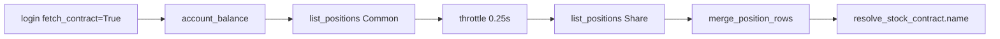

# Shioaji 帳務 API 使用指南

## 1. 文件目的與讀者

本文件說明如何在 **sino-account** 專案中正確整合永豐金 **Shioaji 帳務 API**：登入、查詢順序、速率限制、序列化與持倉查詢標準流程。

| 讀者 | 用途 |
|------|------|
| 開發者 | 新增 CLI / GUI 功能時避免常見 API 誤用 |
| AI agent | 實作持倉、NAV、報表前對照 canonical 流程 |

**持倉股數、市值、NAV 演算法**（合併規則、反模式）請見 [SINO_POSITION_ALGORITHMS.md](./SINO_POSITION_ALGORITHMS.md)。

**完整 API 欄位參考**（`StockPosition` 等）：[`sino_API_full.md`](../sino_API_full.md)。

**GUI 操作**： [SINO_GUI.md](./SINO_GUI.md)。

---

## 2. 環境與登入

### 2.1 環境變數

複製 [`.env.example`](../.env.example) 為 `.env` 並填入：

| 變數 | 說明 |
|------|------|
| `SJ_API_KEY` | Shioaji API Key |
| `SJ_SEC_KEY` | Shioaji Secret Key |
| `SJ_PRODUCTION` | `true` = 正式環境，`false` = 模擬 |
| `SJ_CA_PATH` / `SJ_CA_PASSWD` | 下單用憑證（查帳務通常不需要） |

專案透過 [`core/session.py`](../src/sino_account/core/session.py) 載入 `.env` 並建立連線。

### 2.2 登入

```python
import shioaji as sj

api = sj.Shioaji(simulation=not production)
api.login(api_key=..., secret_key=..., fetch_contract=True)
```

**`fetch_contract=True` 為必須**，若你需要：

- 持倉列表顯示 **股票名稱**（`Contracts.Stocks[code].name`）
- 績效模組查 **kbars** / 商品檔

### 2.3 連線與商品檔注意事項

| 規則 | 原因 |
|------|------|
| **單一 process、單一連線** | Shioaji 不支援多程式同時 Login |
| **序列化 API 呼叫** | 帳務 API 有速率限制；GUI 使用單一 worker 執行緒 |
| **勿在查詢進行中呼叫 `api.fetch_contracts()`** | 會觸發 `exclusive access lost` |
| Login 時載入商品檔，而非查詢中途重載 | 見 [`login.py`](../src/sino_account/functions/login.py)、[`gui/app.py`](../src/sino_account/gui/app.py) |

若名稱顯示 `(未知)`：Logout 後重新 Login（需 `fetch_contract=True`）。

---

## 3. 帳務 API 速查表

| API | 用途 | 注意 |
|-----|------|------|
| `list_accounts()` | 帳戶列表 | 股票 / 期貨帳戶 |
| `account_balance(account=)` | 現金餘額 | 重點欄位：`acc_balance` |
| `list_positions(account=)` | 持倉（**整股**） | `quantity` 單位為 **張**；**單獨呼叫不完整** |
| `list_positions(account=, unit=Unit.Share)` | 持倉（**零股**） | `quantity` 單位為 **股**；必須與整股合併處理 |
| `list_profit_loss(account, begin, end)` | 已實現損益 | `quantity` 通常為張 |
| `settlements(account=)` | 未來交割 | T+0～T+2，**非**歷史現金流 |
| `margin(account=)` | 期貨保證金 | 股票帳戶績效通常不用 |

### StockPosition 常用欄位

（詳見 [`sino_API_full.md`](../sino_API_full.md)）

| 欄位 | 說明 |
|------|------|
| `code` | 商品代號（如 `0050`、`2330`） |
| `quantity` | 數量（整股=張，零股=股） |
| `price` | 成本均價 |
| `last_price` | 最新成交價 / 現價 |
| `pnl` | 未實現損益 |
| `cond` | 現股、融資、融券等 |
| `direction` | 買 / 賣方向 |

---

## 4. 持倉查詢標準流程（必讀）

**禁止**只呼叫一次 `list_positions()` 就計算總持倉或 NAV。永豐 API 將整股與零股分成不同 `unit` 回傳，且 Share 列在部分情況下代表 **總股數** 而非額外零股（見演算法文件）。



### 4.1 參考實作

Canonical 入口：[`get_positions2.py`](../src/sino_account/functions/get_positions2.py)

```python
from shioaji.constant import Unit
from sino_account.core.serialize import resolve_account, serialize
from sino_account.performance.data.throttle import throttle
from sino_account.performance.analytics.quantity_units import (
    build_code_multipliers,
    merge_position_rows,
    merged_position_market_value,
)

target = resolve_account(api, account)
balance = serialize(api.account_balance(account=target))
throttle()
common = api.list_positions(account=target)
throttle()
share = api.list_positions(account=target, unit=Unit.Share)
# → 序列化、標記 unit、merge_position_rows、算市值與 NAV
```

### 4.2 輸出摘要

`get_positions2()` 回傳：

| 區塊 | 內容 |
|------|------|
| `balance` | 帳戶餘額（含 `acc_balance`） |
| `positions` | 合併後每檔持倉 + `name`、`market_value` |
| `summary` | `acc_balance`、`total_market_value`、`total_unrealized_pnl`、`total_nav` |

文字報表：`format_positions2_report(data)`。

---

## 5. 商品檔與股票名稱

實作：[`contracts.py`](../src/sino_account/performance/data/contracts.py)

```python
from sino_account.performance.data.contracts import resolve_stock_contract

contract = resolve_stock_contract(api, "0050")
name = contract.name  # 例：元大台灣50
```

### Contracts 取值注意

Shioaji 的 `Contracts` **不支援**可靠的 `in` 判斷。請用 try/except 或直接索引（見 `_lookup_contract`）：

```python
# ✗ 不可靠
if code in api.Contracts.Stocks:
    ...

# ✓ 正確
try:
    contract = api.Contracts.Stocks[code]
except (KeyError, TypeError):
    contract = resolve_stock_contract(api, code)
```

### 輸出格式建議

- 表格：`0050` + `元大台灣50` 分列
- 單行：`0050 元大台灣50`
- 無商品檔時顯示 `(未知)` 並提示重新 Login

---

## 6. 序列化與帳戶

模組：[`serialize.py`](../src/sino_account/core/serialize.py)

| 函式 | 用途 |
|------|------|
| `serialize(obj)` | Shioaji 物件 → JSON 安全 dict/list |
| `resolve_account(api, account)` | 未指定時預設 `stock_account` |
| `account_label(account)` | GUI 顯示用標籤 |
| `account_info(account)` | 帳戶結構化資訊 |

**Enum 序列化**：`AccountType`、`FetchStatus` 等 Shioaji builtin enum 會轉成 `.value`，避免 JSON 失敗。

持倉 raw 列建議手動標記 `unit`：

- `list_positions()` → `"Common"`
- `list_positions(unit=Unit.Share)` → `"Share"`

---

## 7. 速率限制與 throttle

永豐帳務 API 約 **5 秒內 25 次**（見 [`sino_API_full.md`](../sino_API_full.md)）。

[`throttle.py`](../src/sino_account/performance/data/throttle.py)：

```python
from sino_account.performance.data.throttle import throttle

throttle()  # 預設 sleep 0.25 秒
```

Positions 2 在 `account_balance` → `list_positions(Common)` → `list_positions(Share)` 之間各呼叫一次 `throttle()`。

---

## 8. 專案內建參考實作

| 需求 | 模組 |
|------|------|
| 合併持倉 + 表格 + NAV 摘要 | [`get_positions2.py`](../src/sino_account/functions/get_positions2.py) |
| 股數 / 市值演算法 | [`quantity_units.py`](../src/sino_account/performance/analytics/quantity_units.py) |
| 帳戶快照（raw 列，見演算法文件警告） | [`collect_snapshot.py`](../src/sino_account/performance/data/collect_snapshot.py) |
| 商品檔 / kbars | [`contracts.py`](../src/sino_account/performance/data/contracts.py) |
| Debug GUI | [SINO_GUI.md](./SINO_GUI.md) |
| 持倉演算法與 AI 檢查清單 | [SINO_POSITION_ALGORITHMS.md](./SINO_POSITION_ALGORITHMS.md) |

---

## 9. 相關文件

- SINO_POSITION_ALGORITHMS.md — 持倉合併、市值、NAV
- SINO_GUI_ARCHITECTURE.md — GUI 模組與執行緒
- INVENTORY_MARKET_VALUE.md — 庫存市值演算法
- sino_API_full.md — API 完整參考
