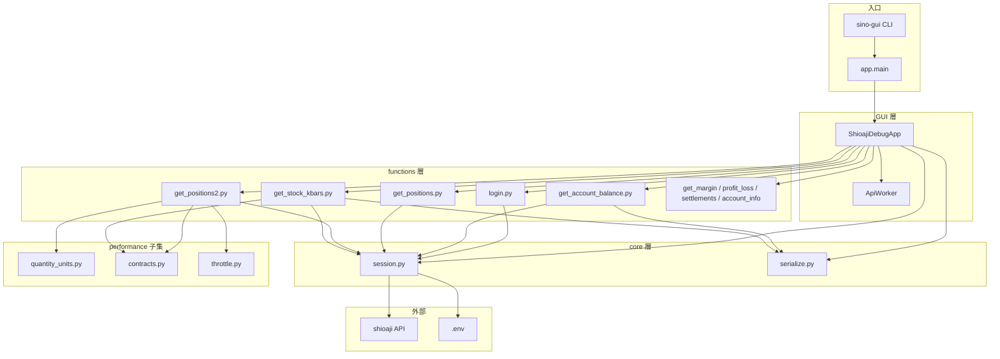
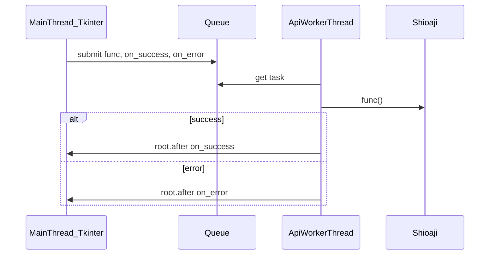
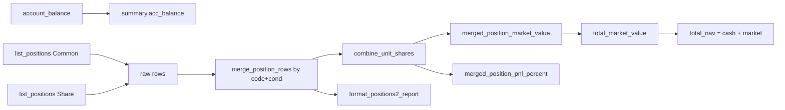
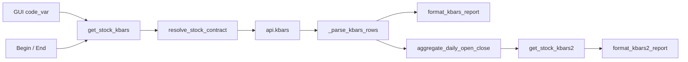

# sino-gui — 程式架構

## 1. 文件目的

本文件描述 **sino-gui**（[`src/sino_account/gui/app.py`](../src/sino_account/gui/app.py)）的程式架構、模組依賴、執行緒模型、Shioaji API 對照，以及 **Get Positions 2**、**Get Stock Kbars** 的資料流與演算法摘要。

使用與操作說明見 [SINO_GUI.md](./SINO_GUI.md)。

**範圍**：`sino_gui` branch 僅保留 `sino-gui` CLI 及其直接依賴的 `functions/`、`core/`、`performance/` 子集（Positions 2 與 K 線查詢）。不含 `performance-3m`、`nav-chart-gui` 等模組。

---

## 2. 與現有專案的關係

```
test/
├── docs/
│   ├── SINO_GUI.md
│   ├── SINO_GUI_ARCHITECTURE.md    # 本文件
│   ├── SINO_API_GUIDE.md
│   ├── SINO_POSITION_ALGORITHMS.md
│   └── INVENTORY_MARKET_VALUE.md
├── src/sino_account/
│   ├── core/                       # session、serialize
│   ├── functions/                  # login、get_*、get_stock_kbars
│   ├── gui/
│   │   └── app.py                  # sino-gui 主程式
│   └── performance/                # Positions 2 / K 線 共用子集
│       ├── analytics/quantity_units.py
│       └── data/contracts.py, throttle.py
├── pyproject.toml                  # 僅 sino-gui entry point
└── .env
```

---

## 3. 整體架構



---

## 4. 最小可運行檔案清單

| 層級 | 路徑 | 用途 |
|------|------|------|
| 入口 | `pyproject.toml` | `sino-gui` script、`shioaji` 依賴 |
| GUI | `gui/app.py` | Tkinter 主視窗、ApiWorker |
| Functions | `functions/login.py` | Login / Logout |
| Functions | `functions/get_account_info.py` | 帳戶列表 |
| Functions | `functions/get_account_balance.py` | 餘額 |
| Functions | `functions/get_positions.py` | 原始持倉 |
| Functions | `functions/get_positions2.py` | 合併持倉 + 報表 |
| Functions | `functions/get_stock_kbars.py` | 分 K / 日開收盤 |
| Functions | `functions/get_margin.py` | 保證金 |
| Functions | `functions/get_profit_loss.py` | 損益（含預設日期） |
| Functions | `functions/get_settlements.py` | 交割 |
| Core | `core/session.py` | API 連線、`.env` |
| Core | `core/serialize.py` | JSON 序列化、帳戶 label |
| 共用 | `performance/analytics/quantity_units.py` | 股數合併、市值、損益% |
| 共用 | `performance/data/contracts.py` | 商品檔、股票名稱 |
| 共用 | `performance/data/throttle.py` | 帳務 API 間隔 |
| 設定 | `.env` | API 憑證 |

`functions/__init__.py`、`gui/__init__.py` 為空檔，非必要。

---

## 5. ApiWorker 執行緒模型

Shioaji **不允許**同一連線上並行 API 呼叫。`ApiWorker` 將所有請求排入單一背景執行緒序列執行。



| 機制 | 說明 |
|------|------|
| `queue.Queue` | FIFO 任務佇列 |
| `daemon=True` | 主程式結束時 worker 一併結束 |
| `root.after(0, ...)` | 回主執行緒更新 UI（Tkinter 執行緒安全） |
| `_busy` | 防止使用者連按兩次觸發重疊請求 |
| `stop()` | 關閉視窗時送 `None` 結束 worker 迴圈 |

### 5.1 兩種請求模式

**標準模式**（`_run_api`）：結果以 JSON 顯示。

```python
self._run_api("get_positions", lambda: get_positions(account))
```

**自訂成功回呼**（純文字表格）：回傳 `str`，使用 `_set_text_output`。

| 按鈕 | 格式化函式 |
|------|------------|
| Get Positions 2 | `format_positions2_report()` |
| Get Stock Kbars | `format_kbars_report()` |
| Get Stock Kbars 2 | `format_kbars2_report()` |

---

## 6. Session 與登入

### 6.1 session.py

全域狀態：

- `_api: Shioaji | None` — 目前連線
- `_environment: str` — `"production"` / `"simulation"`

| 函式 | 說明 |
|------|------|
| `load_env()` | 載入 `.env`（專案根目錄自 `core/session.py` 推算） |
| `create_api()` | `Shioaji(simulation=not SJ_PRODUCTION)` |
| `perform_login(api, fetch_contract=...)` | `api.login(...)` + 可選 `activate_ca` |
| `get_api()` | 未登入時拋 `RuntimeError` |
| `clear_api()` | Logout 後清空 |

### 6.2 login.py 與 GUI

GUI 呼叫：

```python
login(fetch_contract=True)
```

| 行為 | 說明 |
|------|------|
| `fetch_contract=True` | Login 時下載商品檔（Positions 2 名稱、K 線 `resolve_stock_contract`） |
| 已登入但商品檔未就緒 | 自動 `logout` 後重新登入 |
| 不在查詢中呼叫 `fetch_contracts()` | 避免 `exclusive access lost` |

---

## 7. Serialize 與帳戶解析

[`core/serialize.py`](../src/sino_account/core/serialize.py)

### 7.1 serialize(obj)

遞迴將 Shioaji 回傳物件轉為 JSON 可序列化結構：

- `list` / `dict` / dataclass / `obj.dict()` / `vars(obj)`
- Shioaji enum（`FetchStatus`、`AccountType` 等）→ `.value`
- `Kbars.dict()` → 平行陣列 `ts`, `Open`, `High`, `Low`, `Close`, `Volume`, `Amount`

### 7.2 帳戶輔助

| 函式 | 用途 |
|------|------|
| `account_label(account)` | GUI Combobox 顯示，如 `S \| 9A9X-0125618` |
| `account_info(account)` | 結構化 dict |
| `resolve_account(api, account)` | GUI 選中帳戶 → Account 物件；`None` 時用 `stock_account` 或第一個帳戶 |

---

## 8. functions 與 Shioaji API 對照

### 8.1 帳務查詢

| Function 模組 | Python 入口 | Shioaji API | 備註 |
|---------------|-------------|-------------|------|
| `login.py` | `login()` | `api.login(...)` | `fetch_contract` 參數 |
| `login.py` | `logout()` | `api.logout()` | |
| `get_account_info.py` | `get_account_info()` | `api.list_accounts()` | |
| `get_account_balance.py` | `get_account_balance(account)` | `api.account_balance(account=)` | |
| `get_positions.py` | `get_positions(account)` | `api.list_positions(account=)` | 預設整股 |
| `get_positions2.py` | `get_positions2(account)` | 見 §9 | 整股 + 零股 |
| `get_margin.py` | `get_margin(account)` | `api.margin(account=)` | |
| `get_profit_loss.py` | `get_profit_loss(account, begin, end)` | `api.list_profit_loss(...)` | |
| `get_settlements.py` | `get_settlements(account)` | `api.settlements(account=)` | 未來交割 |

帳務 API 速率限制（永豐）：約 **5 秒內 25 次**。Positions 2 在連續呼叫間使用 `throttle()`（0.25 秒）。

### 8.2 行情查詢

| Function 模組 | Python 入口 | Shioaji API | 備註 |
|---------------|-------------|-------------|------|
| `get_stock_kbars.py` | `get_stock_kbars(code, start, end)` | `api.kbars(contract, start, end)` | 分 K OHLCV |
| `get_stock_kbars.py` | `get_stock_kbars2(code, start, end)` | 同上 + 日彙總 | 每日開/收盤 |

行情 `kbars` 另有流量限制（見 [`sino_API_full.md`](../sino_API_full.md) §Kbars）。K 線查詢**不需**選 Account，但需 Login 與商品檔。

---

## 9. Get Positions 2 演算法

> **完整演算法、反模式與 NAV 公式**請以 [SINO_POSITION_ALGORITHMS.md](./SINO_POSITION_ALGORITHMS.md) 為 canonical 來源；本節保留 GUI 脈絡下的資料流摘要。

實作：[`get_positions2.py`](../src/sino_account/functions/get_positions2.py) + [`quantity_units.py`](../src/sino_account/performance/analytics/quantity_units.py)

### 9.1 資料流



### 9.2 原始列合併

1. `list_positions()` → 整股，標記 `unit=Common`
2. `list_positions(unit=Unit.Share)` → 零股，標記 `unit=Share`
3. 依 `(code, cond)` 分組（現股 / 融資等分開）

### 9.3 股數合併 combine_unit_shares

永豐 API 特性：

- **Common 列**：`quantity` 單位為**張**（×1000 = 股）
- **Share 列**：`quantity` 單位為**股**
- 同一標的兩列的 `pnl` 常**相同**（整體未實現損益）
- 當 Share 股數 ≥ Common 股數時，Share 列代表**總股數**，不可與 Common 相加

```python
if common_shares <= 0:
    return share_shares
if share_shares <= 0:
    return common_shares
if share_shares >= common_shares:
    return share_shares          # Share 列 = 總量
return common_shares + share_shares  # Share 列 = 零股增量
```

**範例（0050）**

| 列 | quantity | 換算股數 |
|----|----------|----------|
| Common | 3 張 | 3,000 |
| Share | 3,300 股 | 3,300（總量，非 +3300） |
| **合併** | | **3,300** |

### 9.4 市值 merged_position_market_value

合併後**不可**對每列各加一次 `pnl`：

| 優先順序 | 公式 |
|----------|------|
| 1 | `last_price × total_shares`（對齊庫存「現值 = 現價 × 股數」） |
| 2 | `price × total_shares + pnl`（pnl 只加一次） |
| 3 | `pnl` fallback + warning |

### 9.5 未實現損益% merged_position_pnl_percent

| 項目 | 公式 |
|------|------|
| 單檔 | `pnl ÷ (price × shares) × 100` |
| fallback | `(last_price - price) ÷ price × 100`（成本價 > 0 時） |
| 顯示 | `format_pnl_percent()` → 如 `+3.33%`、`—` |
| 合計 | `total_pnl_pct = Σpnl ÷ Σcost_basis × 100` |

### 9.6 合計

| 欄位 | 公式 |
|------|------|
| `total_market_value` | Σ 各合併列 `market_value` |
| `total_unrealized_pnl` | Σ 各合併列 `pnl`（每 `(code,cond)` 一次） |
| `total_pnl_pct` | 合計未實現損益 ÷ 合計成本 |
| `total_nav` | `acc_balance + total_market_value` |

### 9.7 股票名稱

`resolve_stock_contract(api, code).name` — 需 Login 時 `fetch_contract=True` 載入商品檔。

### 9.8 Get Positions vs Get Positions 2

| 項目 | Get Positions | Get Positions 2 |
|------|---------------|-----------------|
| API 呼叫 | `list_positions()` ×1 | `account_balance` + `list_positions` ×2 |
| 零股 | 不包含 | 合併 |
| 重複 pnl | 不處理（原始 JSON） | 合併後只計一次 |
| 損益% | 無 | 有 |
| 輸出 | JSON | 表格 + 合計 |
| 依賴 performance | 否 | 是 |

---

## 10. Get Stock Kbars 演算法

實作：[`get_stock_kbars.py`](../src/sino_account/functions/get_stock_kbars.py)

### 10.1 資料流



### 10.2 get_stock_kbars（分 K）

1. `resolve_stock_contract(api, code)` 取得商品檔
2. `api.kbars(contract, start, end)` — 回傳平行陣列
3. `_parse_kbars_rows()` — 展開為 `{datetime, Open, High, Low, Close, Volume, Amount}` 列
4. `format_kbars_report()` — 表格輸出；超過 80 筆省略中間段

### 10.3 get_stock_kbars2（日開收盤）

在分 K 基礎上呼叫 `aggregate_daily_open_close()`：

| 欄位 | 規則 |
|------|------|
| 開盤 | 當日**第一根**分 K 的 `Open` |
| 收盤 | 當日**最後一根**分 K 的 `Close` |

`format_kbars2_report()` 只輸出：日期、開盤、收盤。

### 10.4 GUI 輸入

| 控件 | 變數 | 用途 |
|------|------|------|
| Code | `code_var` | 股票代號，預設 `2330` |
| Begin / End | `begin_var` / `end_var` | 與 Get Profit/Loss 共用日期列 |

---

## 11. Throttle

[`performance/data/throttle.py`](../src/sino_account/performance/data/throttle.py)：

```python
QUERY_DELAY_SECONDS = 0.25

def throttle() -> None:
    time.sleep(QUERY_DELAY_SECONDS)
```

Positions 2 在 `account_balance` → `list_positions(Common)` → `list_positions(Share)` 之間呼叫。K 線查詢目前未加 throttle（單次 `kbars` 呼叫）。

---

## 12. GUI 輸出格式

| 方法 | 使用時機 | 格式 |
|------|----------|------|
| `_set_output(payload)` | 帳務 JSON 按鈕 | `json.dumps(..., ensure_ascii=False, indent=2, default=str)` |
| `_set_text_output(text)` | Positions 2、Kbars、Kbars 2 | 固定寬度純文字 |
| `_set_error(exc)` | 例外 | `Error: {Type}: {message}` |

---

## 13. 測試與驗證

| 功能 | 驗證方式 |
|------|----------|
| Get Positions 2 | 比對券商 APP 股數、現值、損益%、NAV |
| Get Stock Kbars | 確認分 K 時間序列與 OHLCV 合理 |
| Get Stock Kbars 2 | 確認每日開收盤與分 K 首尾一致 |

---

## 14. 擴充指南

### 14.1 新增 GUI 按鈕

1. 在 `functions/` 新增 wrapper（呼叫 Shioaji + `serialize`）
2. 在 `app.py` `buttons` 列表加入 `(label, handler)`
3. Handler 使用 `_run_api(...)` 或自訂 `ApiWorker.submit` + `_set_text_output`
4. 所有 Shioaji 呼叫必須在 worker 執行緒內，不可在 Tkinter 主執行緒直接呼叫

### 14.2 注意事項

- 保持 **Login 時 `fetch_contract=True`**（持倉名稱、K 線商品檔）
- **勿**在 API 請求進行中呼叫 `api.fetch_contracts()`
- 帳務 API 遵守速率限制；連續查詢可加 `throttle()`
- 行情 `kbars` 遵守 Shioaji 流量限制，避免短時間大量查詢

---

## 15. 相關文件

- [SINO_GUI.md](./SINO_GUI.md) — 使用指南
- [SINO_API_GUIDE.md](./SINO_API_GUIDE.md) — Shioaji 帳務 API 使用指南
- [SINO_POSITION_ALGORITHMS.md](./SINO_POSITION_ALGORITHMS.md) — 持倉演算法與反模式
- [INVENTORY_MARKET_VALUE.md](./INVENTORY_MARKET_VALUE.md) — 庫存市值演算法
- [sino_API_full.md](../sino_API_full.md) — Shioaji API 完整說明（含 Kbars）
