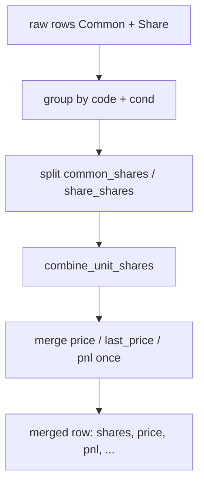

# 持倉演算法與反模式

## 1. 文件目的

本文件定義 sino-account 專案中 **唯一正確** 的持倉股數、市值、未實現損益與 NAV 計算方式，供開發者與 AI agent 在實作前對照。

**API 呼叫順序與登入**：見 [SINO_API_GUIDE.md](./SINO_API_GUIDE.md)。

**Canonical 程式碼**：

- [`quantity_units.py`](../src/sino_account/performance/analytics/quantity_units.py)
- [`get_positions2.py`](../src/sino_account/functions/get_positions2.py)
- [`tests/test_get_positions2.py`](../tests/test_get_positions2.py)

---

## 2. AI 必讀規則（Checklist）

### DO（必須）

- [ ] 依 `(code, cond)` 合併 Common + Share 兩種 API 列
- [ ] 用 `combine_unit_shares()` 計算總股數
- [ ] 合併後用 `merged_position_market_value()` 算市值
- [ ] `pnl` 每個 `(code, cond)` **只取一次**（勿對 raw 多列各加一次）
- [ ] 顯示持倉時附 `name`（需 Login `fetch_contract=True`）
- [ ] 總 NAV = `acc_balance + Σ merged_market_value`

### DON'T（禁止）

- [ ] **勿** 將 `common_shares + share_shares` 無條件相加
- [ ] **勿** 對 Common + Share 兩列各加一次完整 `pnl`（會 ×2）
- [ ] **勿** 對每列 raw 用 `price×shares+pnl` 加總（多列時 pnl 重複）
- [ ] **勿** 假設單次 `list_positions()` 已含零股
- [ ] **勿** 用 `quantity >= 100 → 乘數 1` 等 heuristic 猜單位
- [ ] **勿** 只查整股就輸出 NAV / 總持倉

---

## 3. 單位語意

| 來源 API | `quantity` 單位 | 換算股數 |
|----------|-----------------|----------|
| `list_positions()`（Common） | 張 | `× 1000`（或 contract.unit） |
| `list_positions(unit=Unit.Share)` | 股 | `× 1` |

函式對照：

| 函式 | 用途 |
|------|------|
| `resolve_share_multiplier(record)` | 判斷 1000 或 1 |
| `quantity_to_shares()` / `position_to_shares()` | 單列 raw → 股數 |
| `build_code_multipliers()` | 依 raw 列建立 code → 乘數表 |

---

## 4. 股數合併 `combine_unit_shares`

當同一 `(code, cond)` 同時有 Common 列與 Share 列時：

```
if share_shares >= common_shares:
    total = share_shares   # Share 列 = 總股數（非額外零股）
else:
    total = common_shares + share_shares
```

邏輯實作：[`combine_unit_shares()`](../src/sino_account/performance/analytics/quantity_units.py)

### 4.1 範例：0050（對齊券商庫存「今日餘額」）

| 列 | quantity | 換算股數 | 錯誤加總 |
|----|----------|----------|----------|
| Common | 3 張 | 3,000 | |
| Share | 3,300 股 | 3,300（**總量**） | 6,300 ✗ |
| **正確** | | **3,300** | |

`share_shares (3300) >= common_shares (3000)` → 取 **3300**。

### 4.2 範例：小量零股切片

| Common | Share | 結果 |
|--------|-------|------|
| 3,000 股（3 張） | 300 股 | 3,300（相加） |

`300 < 3000` → `common + share`。

### 4.3 範例：2330 僅整股

僅 Common 列、無 Share 列 → 總股數 = Common 換算股數（如 1 張 = 1,000 股）。

---

## 5. 合併流程 `merge_position_rows`



要點：

1. 同一 `(code, cond)` 的 `pnl` 在 API 兩列間**重複**，合併時只保留一筆。
2. 當 Share 列代表總股數時，成本均價以 Share 列 `price` × `total_shares` 估算。
3. 輸出列 `unit` 標記為 `"Merged"`，`shares` 為合併後總股數。

---

## 6. 市值公式

完整逐步演算法（純文字、無超連結）見 INVENTORY_MARKET_VALUE.md。

### 6.1 合併列（正確，對齊庫存「現值」）

函式：`merged_position_market_value(position)`

優先順序：

1. **`last_price × total_shares`**（優先，對齊券商庫存表「現值 = 現價 × 今日餘額」）
2. else **`price × total_shares + pnl`**（pnl 只計一次）
3. else **`pnl`** fallback + warning

### 6.2 單列 raw（僅除錯，不可直接加總多列）

函式：`position_market_value(position, multipliers)`

- 對 **未合併** 的單列有效
- `calc_positions_market_value()` 對 raw 列表逐列加總 → **在 Common+Share 並存時會錯**（見 §9）

### 6.3 0050 市值驗證

```
shares = 3300
last_price = 101.95
market_value = 101.95 × 3300 = 336,435
```

（見 [`test_merge_matches_inventory_market_value_formula`](../tests/test_get_positions2.py)）

---

## 7. 未實現損益合計

**正確**（合併後）：

```
total_unrealized_pnl = Σ merged_row.pnl   # 每 (code, cond) 一筆
```

**錯誤**：

```
# Common pnl + Share pnl → 同一標的損益 ×2
```

---

## 8. NAV（總資產）

```
snapshot_nav = acc_balance + total_market_value
```

其中：

- `acc_balance` 來自 `account_balance()`
- `total_market_value` = 各 **合併列** `merged_position_market_value()` 之和

**勿**用 raw 列逐列加總市值再算 NAV（除非已先 `merge_position_rows`）。

---

## 9. 本 branch 範圍

`sino_gui` branch 僅保留 sino-gui 與 Get Positions 2 所需模組。持倉市值以 `get_positions2` + `merge_position_rows` 為 **Canonical** 實作。

---

## 10. 持倉列表輸出建議欄位

參考 [`format_positions2_report()`](../src/sino_account/functions/get_positions2.py)：

| 欄位 | 來源 |
|------|------|
| `code` | API |
| `name` | `resolve_stock_contract(api, code).name` |
| `shares_lots` | `format_shares_lots(shares)`（如 `3張330股`） |
| `shares` | 合併後總股數 |
| `price` / `last_price` | 合併列 |
| `pnl` | 合併列（一次） |
| `market_value` | `merged_position_market_value` |
| `cond` | 現股 / 融資等 |

---

## 11. 常見反模式速查

| 反模式 | 後果 | 正確做法 |
|--------|------|----------|
| 只呼叫 `list_positions()` | 漏零股或股數錯 | Common + Share 都查 |
| `common + share` 無條件相加 | 0050 變 6300 股 | `combine_unit_shares` |
| raw 兩列各加 `pnl` | 未實現損益 ×2 | 合併後加總一次 |
| raw 兩列各算 `price×shares+pnl` | 市值與 pnl 雙重計算 | `merged_position_market_value` |
| 無 `fetch_contract` | 名稱全空 | Login `fetch_contract=True` |
| 查詢中 `fetch_contracts()` | `exclusive access lost` | Login 時載入 |

---

## 12. 驗證

### 12.1 手動驗證

1. `sino-gui` → Login → **Get Positions 2**
2. 與券商 APP 比對：
   - **今日餘額** ↔ 合併後 `shares`
   - **現值** ↔ `market_value`
   - **現金 + 持倉現值** ↔ `total_nav`

---

## 13. 相關文件

- SINO_API_GUIDE.md — API 使用與查詢流程
- SINO_GUI_ARCHITECTURE.md §9 — GUI 端 Positions 2 資料流
- INVENTORY_MARKET_VALUE.md — 庫存市值逐步演算法
- sino_API_full.md — StockPosition 欄位參考
